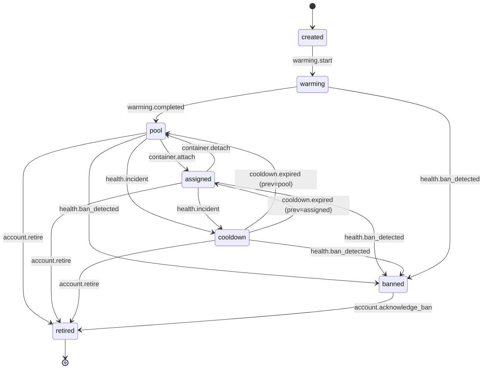

# Neuro-Commenting — детальное проектирование

Продолжение `system-design.md`. Здесь — точные таблицы БД, машина стадий, скелет справочника фингерпринтов и типов задач arq.

Реестр модулей отложен до появления второго модуля (parser). Пока commenting монтируется явно.

---

## 1. Схема БД

Postgres. Все id — `bigint` autoincrement, кроме указанного. Все таймстампы — `timestamptz`. Мягкое удаление не используется (аккаунты уходят в `retired`/`banned`, но остаются).

### 1.1 Shared-таблицы

#### `proxies`

| Поле | Тип | Комментарий |
|------|-----|-------------|
| `id` | bigint PK | |
| `host` | text | |
| `port` | int | |
| `login` | text NULL | |
| `password_enc` | bytea NULL | шифр |
| `type` | text | `socks5` \| `http` |
| `geo` | text NULL | ISO страна |
| `status` | text | `alive` \| `dead` \| `unchecked` |
| `last_checked_at` | timestamptz NULL | |
| `created_at`, `updated_at` | timestamptz | |

**Индексы:** `(status)` — для запроса «дай живые незанятые прокси».

#### `personas`

| Поле | Тип | Комментарий |
|------|-----|-------------|
| `id` | bigint PK | |
| `name` | text | |
| `avatar_template_url` | text NULL | |
| `bio_template` | text NULL | |
| `personality_tags` | jsonb | массив строк |
| `created_at` | timestamptz | |

#### `accounts`

| Поле | Тип | Комментарий |
|------|-----|-------------|
| `id` | bigint PK | |
| `phone` | text UNIQUE | |
| `username` | text NULL | |
| `bio` | text NULL | |
| `avatar_url` | text NULL | |
| `session_enc` | bytea | зашифр. `.session` |
| `proxy_id` | bigint FK proxies NULL | |
| `persona_id` | bigint FK personas NULL | |
| `status` | text | см. машину стадий |
| `previous_status` | text NULL | для возврата из `cooldown` |
| `assigned_container_type` | text NULL | напр. `commenting` |
| `assigned_container_id` | bigint NULL | id инстанса в модуле |
| `warming_profile` | text | `minimal` \| `medium` \| `dense`, default `medium` |
| `warming_started_at` | timestamptz NULL | |
| `activated_at` | timestamptz NULL | момент выхода из первичного `warming` в `pool` |
| `cooldown_until` | timestamptz NULL | до какого момента отдыхает |
| `device_model` | text | фингерпринт, immutable после `created` |
| `system_version` | text | |
| `app_version` | text | |
| `lang_code` | text | |
| `system_lang_code` | text | |
| `created_at`, `updated_at` | timestamptz | |

**Constraints:**
- `status IN (created, warming, pool, assigned, cooldown, retired, banned)` (CHECK)
- `warming_profile IN (minimal, medium, dense)` (CHECK)
- **Эксклюзивность назначения:** `(assigned_container_type IS NULL) = (assigned_container_id IS NULL)` (CHECK)
- Уникальность: **не более одного аккаунта на один контейнер** — обеспечивается на уровне сервиса; при желании можно партиальный UNIQUE index `(assigned_container_type, assigned_container_id, id) WHERE status = 'assigned'` с проверкой на приложении

**Индексы:**
- `(status)` — запросы по стадии, «все в `pool` с warming_profile=X»
- `(status, warming_profile) WHERE status = 'pool'` (partial) — планировщик поддерживающего прогрева
- `(assigned_container_type, assigned_container_id)` — раннеры модулей берут «свои» аккаунты
- `(cooldown_until) WHERE status = 'cooldown'` (partial) — цикл возврата
- `(proxy_id)`, `(persona_id)`

**Про фингерпринт как immutable:** контролируется в сервисе (репозиторий отказывается обновлять эти поля, если аккаунт не в `created`). Триггер БД можно добавить, но для пета — избыточно.

#### `warming_activities`

Лог всех действий прогрева, и первичного, и поддерживающего.

| Поле | Тип | Комментарий |
|------|-----|-------------|
| `id` | bigint PK | |
| `account_id` | bigint FK accounts | |
| `kind` | text | `initial` \| `maintenance` |
| `action_type` | text | `subscribe_channel` \| `read_history` \| `reaction` \| `view_media` \| `join_group` \| `idle_online` \| `update_profile` |
| `target` | text NULL | id канала / чата / сообщения |
| `status` | text | `done` \| `failed` \| `skipped` |
| `meta` | jsonb NULL | |
| `created_at` | timestamptz | |

**Индексы:**
- `(account_id, created_at DESC)` — карточка аккаунта, лента активности
- `(kind, created_at)` — метрики по типу прогрева

#### `health_events`

| Поле | Тип | Комментарий |
|------|-----|-------------|
| `id` | bigint PK | |
| `account_id` | bigint FK accounts | |
| `event_type` | text | `flood_wait` \| `spam_block` \| `restricted` \| `proxy_down` \| `session_revoked` \| `auth_failed` |
| `meta` | jsonb NULL | флудвейт в секундах и т.п. |
| `resolved` | bool default false | |
| `triggered_status_change` | text NULL | напр. `pool→cooldown` |
| `created_at` | timestamptz | |
| `resolved_at` | timestamptz NULL | |

**Индексы:**
- `(account_id, created_at DESC)`
- `(resolved) WHERE resolved = false` (partial) — дашборд алертов

#### `account_status_history` (аудит переходов)

| Поле | Тип | Комментарий |
|------|-----|-------------|
| `id` | bigint PK | |
| `account_id` | bigint FK accounts | |
| `from_status` | text NULL | NULL при создании |
| `to_status` | text | |
| `reason` | text | код события, см. машину стадий |
| `initiator` | text | `user` \| `auto` \| `health` |
| `meta` | jsonb NULL | |
| `created_at` | timestamptz | |

**Индексы:** `(account_id, created_at DESC)` — таймлайн стадий в карточке.

### 1.2 Модуль `commenting`

Живёт в схеме `commenting` (Postgres schema) — так модуль изолирован от shared.

#### `commenting.campaigns`

| Поле | Тип | Комментарий |
|------|-----|-------------|
| `id` | bigint PK | |
| `name` | text | |
| `target_channel` | text | @username или id |
| `discussion_group_id` | bigint NULL | id группы обсуждений (заполняется автоматически) |
| `base_system_prompt` | text | |
| `llm_provider` | text | `deepseek` \| `gemini` |
| `active_hours_start` | time | локальное окно активности |
| `active_hours_end` | time | |
| `active_hours_tz` | text | напр. `Europe/Kiev` |
| `posting_delay_min_sec` | int | |
| `posting_delay_max_sec` | int | |
| `enabled` | bool default true | |
| `created_at`, `updated_at` | timestamptz | |

#### `commenting.campaign_accounts` (M2M)

| Поле | Тип | Комментарий |
|------|-----|-------------|
| `campaign_id` | bigint FK campaigns | |
| `account_id` | bigint FK accounts UNIQUE | UNIQUE = аккаунт максимум в одной кампании (эксклюзивность на уровне модуля) |
| `override_prompt` | text NULL | |
| `created_at` | timestamptz | |

**PK:** `(campaign_id, account_id)`.

#### `commenting.comment_logs`

| Поле | Тип | Комментарий |
|------|-----|-------------|
| `id` | bigint PK | |
| `campaign_id` | bigint FK campaigns | |
| `account_id` | bigint FK accounts | |
| `post_channel_msg_id` | bigint | id поста в канале |
| `posted_message_id` | bigint NULL | id коммента в группе |
| `comment_text` | text | |
| `in_reply_to_message_id` | bigint NULL | тред-симуляция |
| `status` | text | `posted` \| `failed` \| `flagged` |
| `error` | text NULL | |
| `created_at` | timestamptz | |

**Индексы:**
- `(campaign_id, created_at DESC)` — лог кампании
- `(account_id, created_at DESC)` — что писал аккаунт
- `(post_channel_msg_id)` — собрать тред по посту

### 1.3 Что НЕ храним в БД

- Redis-очередь задач — источник правды по «что делать сейчас», не по «что было».
- Rate-limit-счётчики governor'а — тоже в Redis (TTL-ключи).
- Кэш горячих данных — потом, если понадобится.

---

## 2. Машина стадий аккаунта

Единственный источник правды о доступности аккаунта. Все переходы пишутся в `account_status_history`.

### 2.1 Стадии

| Стадия | Смысл | Можно назначить в контейнер? |
|--------|-------|------------------------------|
| `created` | Сессия и фингерпринт есть. Логин не завершён либо только что. | Нет |
| `warming` | Первичный прогрев, идёт по расписанию. | Нет |
| `pool` | Свободен, в библиотеке. Идёт поддерживающий прогрев. | **Да** |
| `assigned` | Занят одним контейнером. | Уже занят |
| `cooldown` | Отдыхает после инцидента. `cooldown_until` — до когда. | Нет |
| `retired` | Ручной вывод из работы. | Нет |
| `banned` | Забанен Telegram. Терминальная стадия. | Нет |

### 2.2 Таблица переходов

`инициатор`: `user` — из Mini App; `auto` — плановый переход воркера; `health` — от health-монитора.

| Из | В | Событие | Инициатор | Побочные эффекты |
|----|---|---------|-----------|------------------|
| — | `created` | `account.created` | user | Записан фингерпринт, привязан прокси |
| `created` | `warming` | `warming.start` | auto | Проставлен `warming_started_at`, стартует джоб первичного прогрева |
| `warming` | `pool` | `warming.completed` | auto | Проставлен `activated_at`. Дальше — поддерживающий прогрев |
| `pool` | `assigned` | `container.attach` | user | Заполнены `assigned_container_*`, поддерживающий прогрев приостановлен для этого аккаунта |
| `assigned` | `pool` | `container.detach` | user | Очищены `assigned_container_*`, возобновлён поддерживающий прогрев |
| `pool` | `cooldown` | `health.incident` | health | Сохранён `previous_status=pool`, проставлен `cooldown_until`, создан `HealthEvent` |
| `assigned` | `cooldown` | `health.incident` | health | Сохранён `previous_status=assigned` (контейнер помнится), кампания пропускает аккаунт |
| `cooldown` | `pool` | `cooldown.expired` | auto | Только если `previous_status=pool` |
| `cooldown` | `assigned` | `cooldown.expired` | auto | Только если `previous_status=assigned` и контейнер ещё существует |
| Любая (кроме `banned`) | `retired` | `account.retire` | user | Если был `assigned` — сначала автоматически `detach` |
| Любая | `banned` | `health.ban_detected` | health | Терминально. `assigned_container_*` очищены. |
| `banned` | `retired` | `account.acknowledge_ban` | user | Ручной, чтобы убрать из активных алертов |

### 2.3 Что запрещено (и как ловить)

- `banned → *` кроме `retired` — CHECK на уровне сервиса, попытка → ошибка.
- `pool ↔ warming` — обратного пути нет. Если аккаунт «сломался» на прогреве, он идёт в `retired`/`banned`, а не назад.
- Прямой `assigned → assigned` в другой контейнер — запрещён. Сначала `detach → pool`, потом `attach` в новый.
- Смена `warming_profile` разрешена в любой стадии, но применяется только пока аккаунт в `pool`.

### 2.4 Реализация

Один класс `AccountStateMachine` в `core/state_machine/account.py`. Единственная точка, где меняется `Account.status`. Публичный API:

```python
sm.transition(account_id, event, initiator, meta=None)
```

Внутри: загружает `Account`, проверяет разрешённость перехода по таблице, применяет побочные эффекты в транзакции с записью в `account_status_history`, публикует событие в Redis pub/sub для API.

**Никто вне state machine не имеет права писать в `accounts.status` напрямую.** Репозиторий `AccountRepository` не даёт метода `update_status` — только через state machine.

### 2.5 Диаграмма



---

## 3. Справочник фингерпринтов (скелет)

Файл `worker/fingerprint/device_pool.json` — статичный справочник согласованных связок. Обновляется руками раз в квартал.

Формат:

```json
[
  {
    "platform": "android",
    "device_model": "Samsung SM-S928B",
    "system_version": "SDK 34",
    "app_version": "10.14.5 (5218)"
  },
  {
    "platform": "ios",
    "device_model": "iPhone15,3",
    "system_version": "17.5.1",
    "app_version": "10.14.5"
  },
  {
    "platform": "desktop",
    "device_model": "PC 64bit",
    "system_version": "Windows 11",
    "app_version": "5.3.2 x64"
  }
]
```

Правила отбора связок для сборника:
- Только реально существующие модели и актуальные версии Telegram под платформу.
- ~20–30 связок с разбросом по платформам и производителям.
- Не должно быть подозрительных комбинаций (iPhone + Android SDK и т.п.).

Логика `FingerprintGenerator`:
- При создании аккаунта берёт свободную (неиспользуемую в пуле) связку случайным образом.
- Дополняет `lang_code`/`system_lang_code` согласно `Proxy.geo`.
- Сохраняет в `accounts.*` — дальше не меняется.

Обновление справочника: раз в квартал открываешь актуальные версии Telegram (Play, App Store, tdesktop releases) и правишь JSON. Никакого автосборщика на старте.

---

## 4. Задачи arq (скелет)

Тонкая обёртка `core/queue/tasks.py` над arq. Все задачи регистрируются в одном `WorkerSettings.functions`. Диспетчер задач воркера использует эти же имена.

### 4.1 Список типов задач

Shared:

- `account.login_start(account_id)` — отправить код.
- `account.login_confirm(account_id, code)` — ввести код.
- `account.login_password(account_id, password)` — 2FA.
- `account.start_warming(account_id)` — запуск первичного прогрева.
- `warming.tick(account_id)` — одно действие прогрева (первичного или поддерживающего). Планируется рекуррентно.
- `warming.maintenance_scheduler()` — cron-задача, каждые N минут выбирает аккаунты из `pool` и планирует им `warming.tick` с джиттером.
- `health.check_proxies()` — cron, раз в 10 минут.
- `health.cooldown_return()` — cron, каждую минуту, возвращает истёкшие `cooldown` в `previous_status`.
- `account.retire(account_id)`, `account.acknowledge_ban(account_id)` — из UI.

Модуль commenting:

- `commenting.on_new_post(campaign_id, channel_msg_id)` — реакция слушателя на пост, запускает генерацию комментов.
- `commenting.post_comment(campaign_id, account_id, text, in_reply_to)` — отдельная задача постинга (проходит через governor, задержка).

### 4.2 Ключи и очереди

Одна очередь по умолчанию (arq: `arq:queue`). Для приоритетов — отдельная очередь `arq:queue:high` для логина и health-событий (arq поддерживает несколько очередей через отдельные воркер-инстансы, но для пета — одна).

### 4.3 Ретраи и dead-letter

Настройки arq на уровне задачи:
- `max_tries = 3` для большинства.
- Для Telethon-задач — обработка `FloodWaitError` как отложенного ретрая на `wait_seconds` (не считается ошибкой).
- Финально упавшие задачи arq сохраняет в свою dead-letter коллекцию — этого достаточно на старте.

### 4.4 Обёртка

```python
# core/queue/tasks.py
class TaskQueue:
    async def enqueue(self, task_name: str, *args, **kwargs): ...
    async def schedule(self, task_name: str, run_at: datetime, *args, **kwargs): ...
```

Если в будущем меняем arq на Celery — меняем только реализацию `TaskQueue`, бизнес-код (`await tq.enqueue("account.login_start", account_id=42)`) остаётся.

---

## 5. Что не делаем сейчас (и почему)

- **Реестр модулей** — пока один модуль, монтируем всё явно. Реестр разработаем, когда добавим `parser`.
- **Полный контур `client_pool`** — контракт описан в v2 дизайна, отдельного документа не нужно. Пишется на этапе имплементации.
- **Метрики, дашборды, экспорты** — v2+.

Следующий шаг после этой сессии: UI-дизайн Mini App (макеты экранов), потом переходим к имплементации по приоритету из роадмапа.
