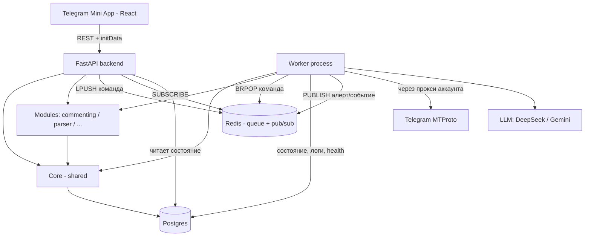
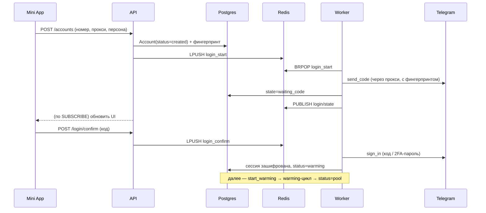
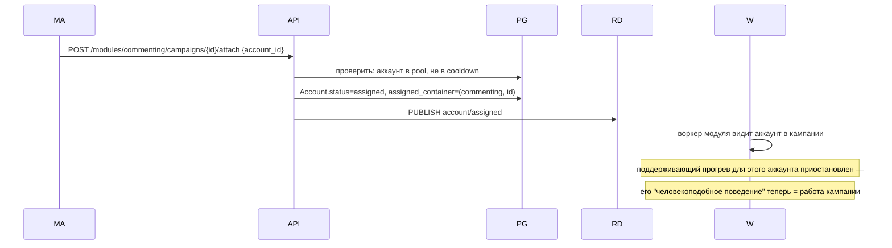
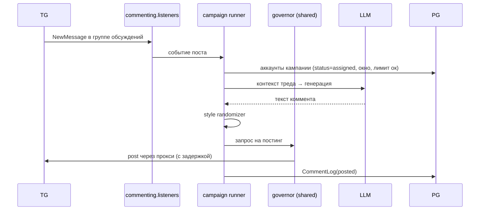
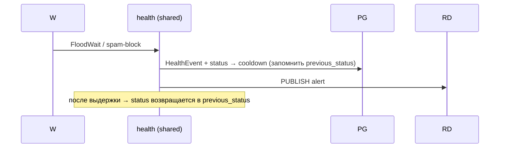

# Neuro-Commenting — дизайн системы (v2)

Документ отвечает на вопрос "что к чему и что от чего зависит": слои, границы, граф зависимостей, структура проекта и потоки данных. Реализация — отдельно, здесь только карта.

**Что изменилось в v2:**
- Архитектура стала **модульной**: shared-фундамент + подключаемые модули (commenting, parser, ...).
- Введено понятие **Pool** — библиотека свободных аккаунтов с автоматическим поддерживающим прогревом.
- Уточнены **стадии аккаунта** (`pool`, `assigned`) и правило эксклюзивности.
- Добавлены **пресеты прогрева** (`minimal | medium | dense`, дефолт `medium`).
- Стек зафиксирован: Postgres + **Redis (с самого старта)** + FastAPI + **React** для Mini App.
- Очередь задач переехала из Postgres-таблицы в Redis.

---

## 1. Слои и ответственность

Ключевая идея: **процесс API и процесс воркера разделены и не вызывают друг друга напрямую — только через Redis / БД.** Поверх общего фундамента живут независимые модули.

| Слой | Процесс | За что отвечает | Чего НЕ делает |
|------|---------|-----------------|----------------|
| **Presentation** | — (WebView) | Telegram Mini App на **React**: UI аккаунтов, модулей, персон, логов, прогрева | Никакой логики Telethon/LLM |
| **API** | FastAPI | CRUD, авторизация initData, публикация команд в Redis, чтение состояния | Не держит `TelegramClient`, не постит, не гоняет LLM |
| **Worker** | Отдельный процесс | Владеет пулом `TelegramClient`, слушает каналы, прогрев (первичный + поддерживающий), health, LLM-генерация, постинг, парсинг | Не обслуживает HTTP-запросы |
| **Modules** | плагины поверх Core + Worker | Свой функционал: commenting / parser / … Каждый модуль — свои модели, роутеры, воркер-раннеры, экраны | Не трогает shared-слой напрямую в обход Core API |
| **Core (shared)** | библиотека | Общие модели, репозитории, схемы, шифрование, enum'ы, конфиг, реестр модулей | Ничего внутреннего не импортирует (базовый слой) |
| **Data** | Postgres + Redis | Postgres: состояние. Redis: очередь задач, pub/sub, rate-limit-счётчики governor'а | — |
| **External** | — | Telegram MTProto (через прокси), LLM (DeepSeek/Gemini) | — |

### Почему API и Worker — разные процессы

Telethon-клиенты долгоживущие и блокирующие, живут в одном asyncio event loop, и `.session` нельзя открывать конкурентно из двух процессов. Поэтому:

- **Единоличный владелец сессий — только Worker.** API никогда не инстанцирует `TelegramClient` для долгоживущих операций.
- **Граница между слоями — Redis.** API кладёт команду в очередь → Worker её подхватывает → пишет состояние в Postgres → API читает и отдаёт в Mini App. Для «живых» уведомлений — pub/sub (алерты health, статус логина).

---

## 2. Модульная архитектура

Система = **shared-фундамент** + **модули поверх**. Модуль — это тип работы (commenting, parser). Внутри модуля — **контейнеры** (инстансы): у commenting контейнер = кампания, у parser контейнер = джоба.

### Что принадлежит фундаменту (общее для всех модулей)

- `Account`, `Proxy`, `Persona`, фингерпринт, сессии, шифрование
- `WarmingActivity` + движок прогрева (первичный и поддерживающий)
- `HealthEvent` + health-монитор + rate-limit governor
- Машина стадий аккаунта
- Очередь задач (Redis)
- `client_pool` — единственный владелец `TelegramClient`

### Что принадлежит модулю

- Свои модели (напр. `Campaign`, `CommentLog` у commenting; `ParserJob`, `ParsedMessage` у parser)
- Свои API-роутеры (`/modules/commenting/*`, `/modules/parser/*`)
- Свой воркер-раннер (слушатели, планировщики, обработчики)
- Свои экраны в Mini App

### Правила

- Модуль **зависит** от фундамента — берёт живые аккаунты через Core API.
- Фундамент **не знает** о модулях — новый модуль подключается, не трогая ядро.
- **Реестр модулей** (`core/modules/registry`) — единая точка регистрации: модуль объявляет свои таблицы, роуты, экраны Mini App, типы задач для воркера.
- **Аккаунт занят одним контейнером за раз** (эксклюзивность). Смена работы = явный релиз + новое назначение.

---

## 3. Pool — библиотека аккаунтов и поддерживающий прогрев

Аккаунт, не привязанный ни к какому контейнеру, находится в **пуле** — это не «мёртвый груз», а активный резерв с фоновой человекоподобной активностью.

### Отличие от первичного прогрева

- **Первичный прогрев (`warming`)** — разовая процедура «до готовности», после создания аккаунта. Заканчивается переходом в пул.
- **Поддерживающий прогрев (в `pool`)** — непрерывный фон, пока аккаунт свободен. Не заканчивается — только приостанавливается, когда аккаунт назначен в контейнер.

Обе разновидности пишут в одну и ту же таблицу `WarmingActivity`.

### Пресеты интенсивности (`WarmingProfile`)

- **`minimal`** — заходить онлайн раз в несколько дней, редкие чтения. Против деактивации по бездействию.
- **`medium` (дефолт)** — раз в день короткая сессия человекоподобных действий: пара просмотров, редкая реакция, случайное окно онлайн. Аккаунт выглядит как тихий читатель.
- **`dense`** — несколько заходов в день, подписки, взаимодействия. Ближе к активному пользователю. Больше защиты, но и больше поверхности для антифрода.

Пресет задаётся на аккаунт или наследуется от настройки пула. Смена пресета — в любой момент из Mini App.

---

## 4. Стадии аккаунта

```
created → warming → pool ↔ assigned → (cooldown → возврат туда, откуда пришёл)
                       ↓
                    retired / banned
```

| Стадия | Что это |
|--------|---------|
| `created` | Сессия есть, фингерпринт зафиксирован, прокси привязан. Не трогаем работой. |
| `warming` | Первичный прогрев до готовности. |
| `pool` | В библиотеке, свободен. Идёт поддерживающий прогрев по выбранному пресету. |
| `assigned` | Занят конкретным контейнером модуля. `assigned_container_id` не NULL. |
| `cooldown` | После инцидента (флудвейт, spam-block). После выдержки возвращается туда, откуда пришёл (в `pool` или `assigned`). |
| `retired` | Ручной вывод из пула. |
| `banned` | Забанен Telegram. |

Инварианты:

- Аккаунт с `status = assigned` имеет ровно один `assigned_container_id`.
- Аккаунт с `status = pool` не имеет привязки к контейнеру.
- Переход `pool → assigned` возможен только когда аккаунт `active` и не в `cooldown`.

---

## 5. Граф зависимостей



Правило направления: стрелки идут вниз, к более базовым слоям. **API и Worker не связаны стрелкой напрямую** — их развязывает Redis. Модули опираются на Core, но не на API/Worker напрямую (регистрируются через Core).

---

## 6. Структура проекта (каталоги)

Монорепо. Ядро — общее, модули — параллельно. Frontend в том же репо, отдельной папкой.

```
neuro-commenting/
├── core/                     # shared, импортируется API, Worker, модулями
│   ├── config/               # настройки, ENV, провайдеры
│   ├── models/               # ORM: Account, Proxy, Persona, WarmingActivity,
│   │                         #   HealthEvent, WarmingProfile, ...
│   ├── enums/                # AccountStatus, HealthEventType,
│   │                         #   WarmingActionType, WarmingIntensity, TaskType
│   ├── schemas/              # pydantic-схемы (вход/выход API, DTO задач)
│   ├── repositories/         # доступ к БД (единая точка запросов)
│   ├── crypto/               # шифрование .session и фингерпринта
│   ├── queue/                # обёртки над Redis: enqueue, subscribe, pub/sub
│   └── modules/              # реестр модулей: регистрация роутов, экранов,
│                             #   таблиц, обработчиков задач
│
├── api/                      # FastAPI — только лёгкие операции
│   ├── main.py               # + монтирование роутеров всех модулей из реестра
│   ├── deps/                 # initData-авторизация, сессия БД, Redis
│   ├── routers/              # SHARED роуты:
│   │   ├── accounts.py       # CRUD, пул, назначение/релиз
│   │   ├── login.py          # /login/start, /login/confirm
│   │   ├── proxies.py
│   │   ├── personas.py
│   │   ├── warming.py        # пресеты, WarmingActivity
│   │   └── monitoring.py     # health, дашборд, алерты
│   └── services/             # эмиттеры команд в Redis
│
├── worker/                   # владелец Telethon-пула, отдельный процесс
│   ├── main.py               # bootstrap: пул, слушатели, планировщик,
│   │                         #   регистрация обработчиков модулей
│   ├── client_pool/          # жизненный цикл TelegramClient
│   ├── fingerprint/          # FingerprintGenerator + справочник связок
│   ├── login/                # логин-флоу: код, 2FA, флудвейты
│   ├── warming/              # движок прогрева (первичный + поддерживающий),
│   │                         #   применение пресетов
│   ├── health/               # health-монитор, rate-limit governor,
│   │                         #   машина стадий
│   ├── llm/                  # адаптеры провайдеров + style randomizer (shared,
│   │                         #   т.к. может пригодиться нескольким модулям)
│   └── tasks/                # диспетчер задач из Redis → в модуль/shared
│
├── modules/                  # плагины поверх фундамента
│   ├── commenting/
│   │   ├── models/           # Campaign, CampaignAccount, CommentLog
│   │   ├── api/              # /modules/commenting/*
│   │   ├── worker/           # listeners (NewMessage), runner кампаний,
│   │   │                     #   тред-симуляция
│   │   ├── frontend/         # экраны React для этого модуля
│   │   └── register.py       # регистрация в core/modules/registry
│   └── parser/
│       ├── models/           # ParserJob, ParsedMessage
│       ├── api/              # /modules/parser/*
│       ├── worker/           # раннер джобов
│       ├── frontend/
│       └── register.py
│
├── frontend/                 # React Mini App
│   ├── src/
│   │   ├── app/              # роутер, layout, навбар
│   │   ├── screens/          # SHARED экраны: Главная, Аккаунты, Ещё
│   │   ├── modules/          # loader экранов модулей из реестра
│   │   ├── shared/           # компоненты, tg-initData, api-client
│   │   └── styles/
│   └── ...
│
└── migrations/               # alembic (включая миграции модулей)
```

**Про экраны модулей:** frontend модуля лежит рядом с его backend'ом, но при сборке подтягивается общим фронтом через реестр — так модуль остаётся самодостаточным.

---

## 7. Модель данных — доработки

### Shared

```
Account
  - session (шифр), phone, proxy_id
  - avatar_url, bio, username
  - persona_id
  - status: created | warming | pool | assigned | cooldown | retired | banned
  - assigned_container_type    # nullable: "commenting" | "parser" | ...
  - assigned_container_id      # nullable: id инстанса в модуле
  - warming_profile: minimal | medium | dense   # дефолт medium
  - warming_started_at, activated_at (nullable)
  - device_model, system_version, app_version    # фингерпринт (immutable)
  - lang_code, system_lang_code                  # фингерпринт (immutable)

Proxy
  - host, port, login, pass, type (socks5/http)
  - geo (страна/город)
  - status (alive/dead), assigned_account_id

Persona
  - name, avatar_template, bio_template
  - base personality tags

WarmingActivity  (лог для первичного И поддерживающего прогрева)
  - account_id
  - kind: initial | maintenance
  - action_type: subscribe_channel | read_history | reaction |
                 view_media | join_group | idle_online | update_profile
  - target (nullable)
  - timestamp, status, meta (nullable JSON)

HealthEvent
  - account_id, event_type (flood_wait, spam_block, restricted, proxy_down)
  - timestamp, resolved (bool)
  - triggered_status_change (nullable)
```

### Модули (внутри себя)

**commenting:**
```
Campaign                       # это и есть "контейнер" модуля commenting
  - name, target_channel
  - base_system_prompt, llm_provider (deepseek | gemini)
  - active_hours, posting_delay_range

CampaignAccount (M2M)
  - campaign_id, account_id
  - override_prompt (nullable)

CommentLog
  - account_id, campaign_id, post_id
  - comment_text, timestamp, in_reply_to
  - status (posted | failed | flagged)
```

**parser:** (эскизно, детализируем при работе над модулем)
```
ParserJob                      # контейнер модуля parser
  - name, target_chats, schedule, filters

ParsedMessage
  - parser_job_id, chat_id, message_id, author, text, timestamp
```

### Связь аккаунта с контейнером

Два варианта, выбираем **первый** для простоты и явности:

1. **Плоские поля в `Account`** — `assigned_container_type` + `assigned_container_id`. Просто, но нет FK-целостности между таблицами (проверяется на уровне сервиса).
2. Общая таблица `AccountAssignment(account_id, container_type, container_id)` — целостность через полиморфную ссылку. Сложнее.

Выбор оправдан тем, что эксклюзивность (`один аккаунт = один контейнер`) уже гарантирована самой парой полей.

---

## 8. Потоки данных

### 8.1 Онбординг аккаунта



### 8.2 Назначение аккаунта в контейнер



### 8.3 Новый пост → комментарии (модуль commenting)



### 8.4 Инцидент здоровья



---

## 9. Redis — за что отвечает

- **Очередь команд** API → Worker (`LPUSH` / `BRPOP` по типу задачи).
- **Pub/Sub** — «живые» уведомления Worker → API (алерты health, статус логина, прогресс прогрева). API держит подписчика, при событии обновляет клиента через WebSocket/SSE или следующим poll'ом.
- **Rate-limit-счётчики** governor'а — окна лимитов на-аккаунт и глобальные, с TTL.
- **Кэш «горячего»** состояния (опционально, потом).

Postgres остаётся источником правды по состоянию; Redis — механикой доставки и rate-limit'ов.

---

## 10. Mini App — навигация и экраны (React)

**Навбар (4 таба, потолок для Telegram Mini App):**

1. **Главная** — дашборд.
   Разделы сверху вниз:
   - Алерты (`HealthEvent`-приоритет: cooldown/banned/proxy_down)
   - Сводка по аккаунтам (bar-диаграмма стадий: `warming | pool | assigned | cooldown | banned`)
   - Активные модули и их контейнеры (сколько работает сейчас, что сделали сегодня)
   - Лента активности (последние комментарии, действия прогрева)

2. **Аккаунты** — витрина пула.
   - Список всех аккаунтов, фильтр по стадии, поиск.
   - Карточка аккаунта: стадия, здоровье, прокси, фингерпринт (view-only), персона, пресет прогрева, лента `WarmingActivity`, где занят, кнопки паузы/релиза/назначения.

3. **Задачи** — витрина модулей.
   - Верхний уровень: карточки модулей (`commenting`, `parser`, …).
   - Тап по модулю — его экран (рисует сам модуль): список контейнеров (кампании/джобы), настройки, лог.
   - Внутри контейнера — привязанные аккаунты + свои настройки (промпт/LLM/окна для commenting, целевые чаты/фильтры для parser).

4. **Ещё** — редко используемое.
   - Персоны (библиотека шаблонов)
   - Прокси (пул, проверка живости)
   - Общий аудит-лог
   - Настройки: дефолтный пресет прогрева для пула, окна активности, интеграции LLM

**Экран «Аккаунт» — таймлайн стадий:** показывает историю переходов (`created → warming → pool → assigned:commenting/campaign-42 → cooldown → assigned → pool`) с датами. По этому таймлайну удобно разбирать инциденты.

---

## 11. Логин / 2FA — где живёт

**Логин целиком в воркере** (нужен Telethon), API оркестрирует через Redis-очередь и опрашивает состояние. Флоу: `login_start` → `waiting_code` → пользователь вводит код в Mini App → `login_confirm` → при необходимости `waiting_password` → успех/ошибка. Флудвейты при входе — выдержка с ретраем, не долбёжка.

---

## 12. Инварианты

- Только Worker открывает `.session`. API — никогда.
- API ↔ Worker общаются только через Redis, без прямых вызовов.
- Фингерпринт задаётся при `created` и не меняется.
- Один прокси = один аккаунт; гео прокси = гео номера.
- Каждое исходящее действие проходит через rate-limit governor.
- Аккаунт в один момент времени занят максимум одним контейнером.
- Модули зависят от Core, не наоборот. Новый модуль не требует правок в ядре, кроме регистрации в реестре.
- `AccountStatus` — единственный источник правды о доступности аккаунта.

---

## 13. Что спроектировать следующим шагом

1. **Схема БД** — точные таблицы, поля, связи, индексы (shared + модуль commenting как первый).
2. **Контур `client_pool` + фингерпринт** — как создаётся клиент, откуда берётся справочник device/system/app.
3. **Протокол очереди в Redis** — типы задач, ключи, формат сообщений, обработка ретраев/dead letter.
4. **Машина стадий** — таблица переходов `AccountStatus` и триггеры событий.
5. **Реестр модулей** — контракт: что модуль объявляет о себе (таблицы, роуты, экраны, обработчики задач).
